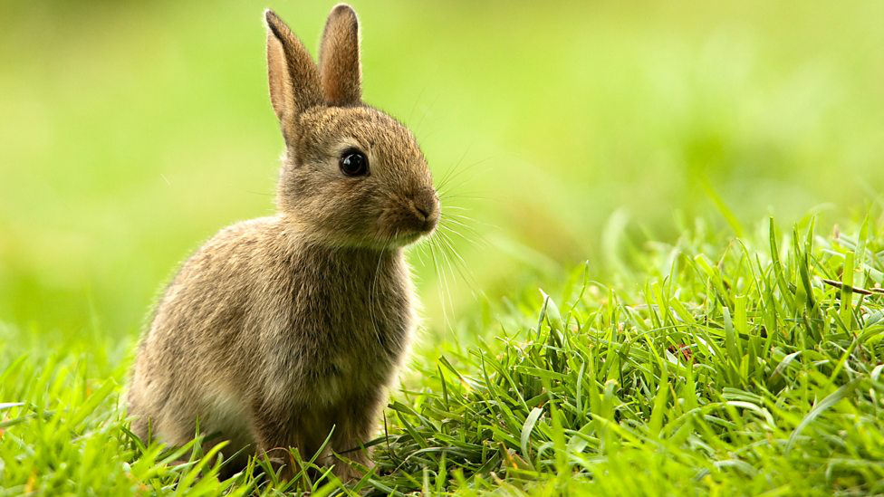

# python-pil-example
파이썬3 기반 Python Image Library(PIL) 예제입니다.


## Python Image Library (PIL) 설치
```bash
pip install pillow 
```

## 바로가기
필요한 예제로 바로 이동하세요!
- 이미지 정보 조회 [img_info.py](https://github.com/leegeunhyeok/python-pil-example/blob/master/img_info.py)
- 이미지 크기 변환 [img_resize.py](https://github.com/leegeunhyeok/python-pil-example/blob/master/img_resize.py)
- 이미지 회전 [img_rotate.py](https://github.com/leegeunhyeok/python-pil-example/blob/master/img_rotate.py)
- 이미지 뒤집기 [img_transpose.py](https://github.com/leegeunhyeok/python-pil-example/blob/master/img_transpose.py)
- 이미지 썸네일 생성 [img_thumbnail.py](https://github.com/leegeunhyeok/python-pil-example/blob/master/img_thumbnail.py)
- 이미지 흑백 변환 [img_greyscale.py](https://github.com/leegeunhyeok/python-pil-example/blob/master/img_greyscale.py)
- 이미지 필터 적용 [img_filter.py](https://github.com/leegeunhyeok/python-pil-example/blob/master/img_filter.py)
- 이미지 RGB 분할 [img_split.py](https://github.com/leegeunhyeok/python-pil-example/blob/master/img_split.py)
- 이미지에 텍스트 추가 [img_draw.py](https://github.com/leegeunhyeok/python-pil-example/blob/master/img_draw.py)
- 스트림에 있는 이미지 저장 [img_save_from_stream.py](https://github.com/leegeunhyeok/python-pil-example/blob/master/img_save_from_stream.py)
- 이미지를 스트림에 저장 [img_save_to_stream.py](https://github.com/leegeunhyeok/python-pil-example/blob/master/img_save_to_stream.py)
- 인터넷상에서 이미지 불러오고 변환 후 저장하기 [img_network_stream.py](https://github.com/leegeunhyeok/python-pil-example/blob/master/img_network_stream.py)

### 원본 이미지
`origin.png`:
[동물이미지](http://www.bbc.co.uk/programmes/articles/2l6crWZnmwrBnCWPsqcZhBw/animals-in-literature-the-ultimate-quiz) 를 예제로 사용합니다.

<div align="center">
  
</div>